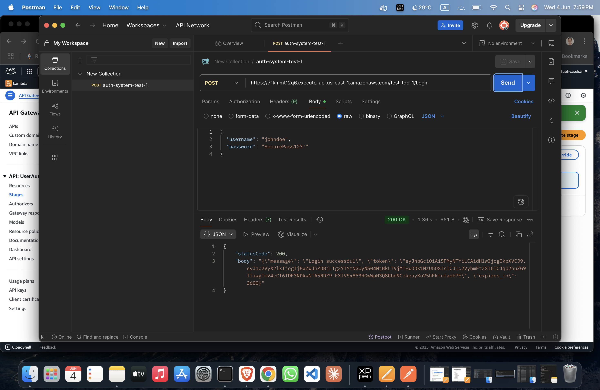
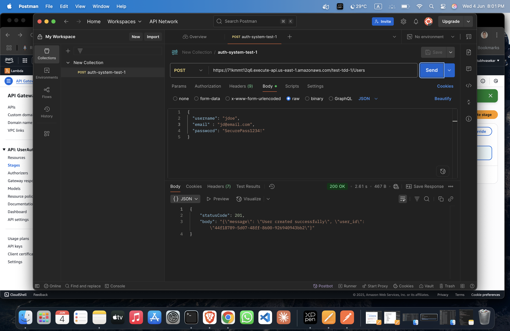
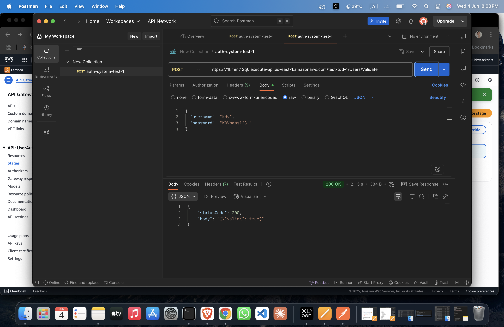
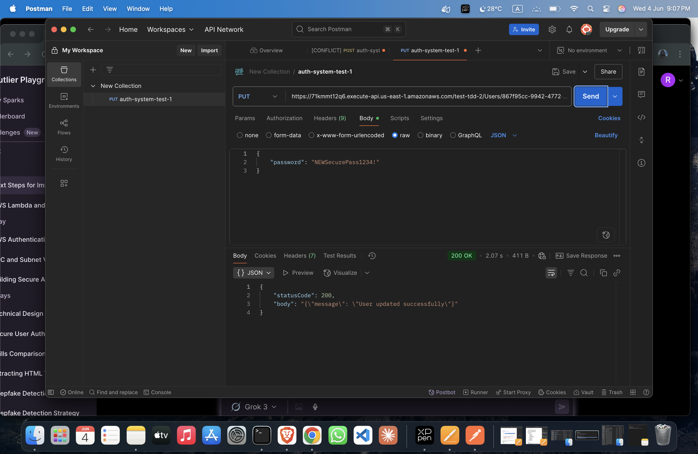

# Secure User Authentication System — AWS Lambda + JWT

A serverless authentication system built on AWS, using Lambda functions behind API Gateway to handle user login, creation, and credential validation — secured with JWT tokens.


---

## 📋 Table of Contents

- [Overview](#overview)
- [Architecture](#architecture)
- [API Endpoints](#api-endpoints)
- [Frontend UI](#frontend-ui)
- [Postman Testing](#postman-testing)
- [Getting Started](#getting-started)
- [Project Structure](#project-structure)

---

## 🎯 Overview

This project implements a **JWT-based secure authentication system** deployed on AWS. It leverages:

- **AWS Lambda** for serverless compute
- **AWS API Gateway** for REST API exposure
- **JWT (JSON Web Tokens)** for stateless authentication
- **AWS RDS** as the user data store
- A lightweight **HTML frontend** for end-user interaction

---

## 🏗 Architecture

```
User / Frontend (imple.html)
        │
        ▼
AWS API Gateway (REST API)
        │
        ├── POST /Login          ──▶  Lambda: Login handler
        ├── POST /Users          ──▶  Lambda: User creation handler
        └── POST /Users/Validate ──▶  Lambda: Token validation handler
                                          │
                                          ▼
                                     AWS RDS (User store)
```

**Key components:**
- **API Gateway**: Exposes REST endpoints, handles CORS, routes requests to Lambda
- **Lambda Functions**: Stateless handlers for each auth operation
- **JWT Tokens**: Issued on successful login, expire in 3600 seconds (1 hour)
- **RDS**: Stores user credentials (hashed passwords)

---

## 🔌 API Endpoints

Base URL: `https://71kmmt12q6.execute-api.us-east-1.amazonaws.com/test-tdd-1`

### POST `/Login`
Authenticate a user and receive a JWT token.

**Request Body:**
```json
{
  "username": "johndoe",
  "password": "SecurePass123!"
}
```

**Response (200 OK):**
```json
{
  "statusCode": 200,
  "body": {
    "message": "Login successful",
    "token": "<JWT_TOKEN>",
    "expires_in": 3600
  }
}
```

---

### POST `/Users`
Create a new user account.

**Request Body:**
```json
{
  "username": "johndoe",
  "email": "johndoe@example.com",
  "password": "SecurePass123!"
}
```

**Response (200 OK):**
```json
{
  "statusCode": 200,
  "body": {
    "message": "User created successfully"
  }
}
```

---

### POST `/Users/Validate`
Validate credentials and confirm user status.

**Request Body:**
```json
{
  "username": "johndoe",
  "password": "SecurePass123!"
}
```

**Response (200 OK):**
```json
{
  "statusCode": 200,
  "body": {
    "message": "User is valid",
    "valid": true
  }
}
```

---

## 🖥 Frontend UI

The `implementation/imple.html` file provides a minimal browser-based UI with three tabs:

| Tab | Action |
|-----|--------|
| **Login** | Submit credentials, receive JWT token |
| **Create User** | Register a new user account |
| **Validate** | Verify user credentials |

To use locally, open `implementation/imple.html` directly in a browser. No build step required.

---

## 🧪 Postman Testing

All endpoints were tested via Postman against the deployed API Gateway. Screenshots are in `postman-screenshots/`.

### Login Endpoint
`POST /Login` — Returns a JWT token on valid credentials (200 OK, ~1.36s response).



---

### Create User Endpoint
`POST /Users` — Creates a new user in the system.



---

### Validate Endpoint
`POST /Users/Validate` — Validates credentials.



---

### Load Test
Performance test verifying the API handles concurrent requests reliably.



---

## 🚀 Getting Started

### Prerequisites
- AWS account with Lambda and API Gateway access
- Node.js (for local Lambda development)
- Postman (for API testing)

### Running the Frontend Locally

1. Clone the repository:
   ```bash
   git clone https://github.com/kaustubhvasekar/auth-system-repo.git
   cd auth-system-repo
   ```

2. Open the UI:
   ```bash
   open implementation/imple.html
   # or just double-click imple.html in Finder
   ```

3. Update `apiUrl` in `imple.html` if you redeploy to a new API Gateway URL:
   ```js
   const apiUrl = 'https://<your-api-id>.execute-api.<region>.amazonaws.com/<stage>';
   ```

### Testing with Postman
Import the Postman collection (if provided) or create requests manually:

| Method | URL | Body |
|--------|-----|------|
| POST | `{base_url}/Login` | `{"username":"…","password":"…"}` |
| POST | `{base_url}/Users` | `{"username":"…","email":"…","password":"…"}` |
| POST | `{base_url}/Users/Validate` | `{"username":"…","password":"…"}` |

---

## 📁 Project Structure

```
JWT_AWS_lambda_auth/
├── implementation/
│   └── imple.html              # Frontend HTML UI (Login / Create / Validate)
├── postman-screenshots/
│   ├── postman-login-test.png          # POST /Login — 200 OK with JWT token
│   ├── postman-users-page-test.png     # POST /Users — user creation
│   ├── postman-validate-page-test.png  # POST /Users/Validate — credential check
│   └── postman-load-test.png           # Load/performance test results
└── README.md
```

---

## 🔐 Security Notes

- JWT tokens expire after **3600 seconds** (1 hour)
- Passwords are never returned in any API response
- All endpoints communicate over **HTTPS** (AWS API Gateway enforces TLS)
- CORS is configured at the API Gateway level

---

## 📝 License

MIT License — see [LICENSE](LICENSE) for details.
